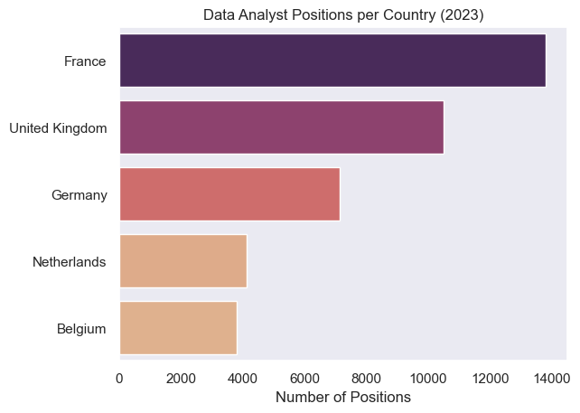
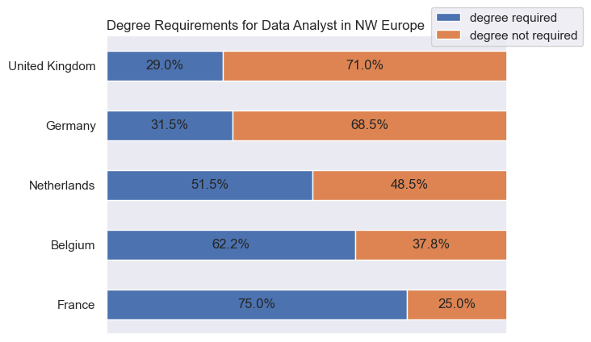
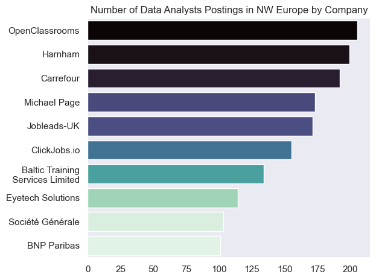
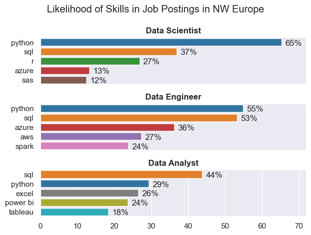
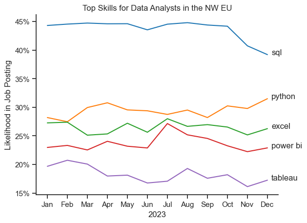
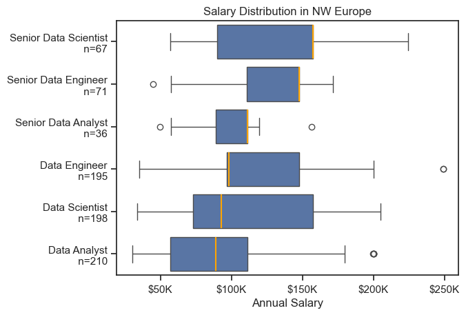
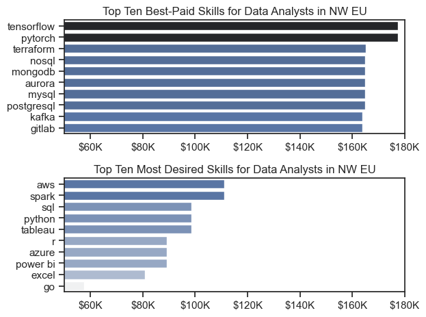
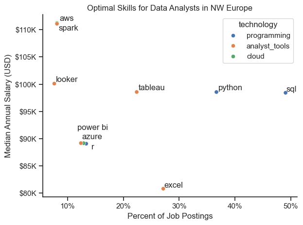

# Introduction 📓

The intent of this project is to investigate data roles with a particular focus on Data Analysts (DA) in North Western Europe. This region for the current project includes the following countries: United Kingdom, France, Belgium, The Netherlands and Germany.

The focus primarily concerns salary information and desired skills for prospective DAs, along with further miscellaneous analyses, such as a breakdown of top hiring companies in the region and whether these positions require a degree.  

The data is sourced from [Luke Barousse's Dataset](lukebarousse/data_jobs), which is an online repository of data concerning job postings for roles in technology from the year 2023.   

# Research Questions 🔎

I wish to answer the following questions in this projet:

1. What skills are most in demand from the most popular data roles?
2. How did in-demand skills for DAs trend throughout 2023?
3. Concerning salary information:
    1. How well do the the varying data roles pay?
   2. How well do the associated skills of a DA pay?
4. What are the optimal skills to learn for a budding DA?

# Tools Used 🧰

I made use of the following tools and libraries in order to perform this analysis:

- **Python**: A general-purpose programming language and the mainstay of my analysis. It allowed me to undergo cleaning, wrangling and plotting of the data, with aid from the following libraries:
  - **Pandas**: A commonly-used library for data analysis.
  - **Matplotlib**: Likewise, commonly-used for plotting.
  - **Seaborn**: A more advanced library for more visually-appealing plots. 
- **Jupyter Notebooks**: An interactive tool I made use of to write Python and perform all of the analyses. It allows for writing and running code in real time. 
- **Visual Studio Code**: My Integrated Development Environment of choice. 
- **Git & GitHub**: Version control and hosting code repositories, which are commonly used.   

# The Analysis 📊

## 1. Exploratory Data Analysis 

 I begin with some exploratory analysis looking for overall trends of interest. 

My notebooks with a detailed step-by-step approach can be viewed here: 

[Exploratory_Data_Analysis](project/eda_intro.ipynb) 

## Visualising Data

Here are some overall patterns:

Firstly, a barchart of job postings for Data Analysts per country:

 

Secondly, a stacked bar chart on whether those jobs from above require a degree:



Finally, those job postings broken down by individual companies:



### Insights

Interestingly, France is a local leader in recruitment of data analysts, with approximately 30% more postings than the UK and almost twice as many as Germany, in second and third place respectively. 

This is also reflected in the breakdown of the top hiring companies: 'OpenClassrooms' and 'Carrefour' are French, while 'HarnHam', 'Michael Page' (Now 'Pageload') and 'JobLeads-UK' are British. The only non-British or French company/platform in the top ten is 
'EyeTech Solutions', which is Belgian.  

While France and the UK are local leaders in recruitment, they are, however, far apart in terms of degree requirements. At 75%, French DA positions overwhelmingly prefer their candidates to have a degree, contrasted with only 29% of British DA positions.    

## Code snippets

Below are the code snippets that correspond to each of the plots in the earlier section. 

``` python
sns.set_theme(style='dark')
sns.barplot(data=df_plot, 
            x='count', 
            y='job_country',
            hue='count',
            palette='flare',
            legend=False
            )

plt.title('Data Analyst Positions per Country (2023)')
plt.ylabel('')
plt.xlabel('Number of Positions')
plt.show()
```
``` python
degree.plot(
    x = 'job_country',
    kind = 'barh',
    stacked = True,
    mark_right = True)

plt.ylabel('')
plt.xlabel('')
plt.xlim((0, 100))
plt.title('Degree Requirements for Data Analyst in NW Europe', loc='left')
plt.legend(bbox_to_anchor=(1, 1.03), loc='center')
plt.gca().set_xticks([])


df_total = degree["degree required"] + degree["degree not required"]
df_rel = degree[degree.columns[1:]].div(df_total, 0)*100
for n in df_rel:
    for i, (cs, ab, pc) in enumerate(zip(degree.iloc[:, 1:].cumsum(1)[n], 
                                         degree[n], df_rel[n])):
        plt.text(cs - ab / 2, i, str(np.round(pc, 1)) + '%', 
                 va = 'center', ha = 'center')
```

``` python
sns.set_theme(style='dark')
ax = sns.barplot(data=df_bar_plot, 
            x='count', 
            y='company_name', 
            hue='count', 
            palette='mako_r', 
            legend=False
            )

labels = [label.get_text() for label in ax.get_yticklabels()]
labels = [label.replace('Baltic Training Services Limited', 'Baltic Training\n Services Limited') for label in labels]
ax.set_yticklabels(labels)

plt.title('Number of Data Analysts Postings in NW Europe by Company')
plt.xlabel('')
plt.ylabel('')
plt.tight_layout()
plt.show()
```

## 2. What are the skills most in demand from the most popular data roles?

In this section, I expand my inquiry to include the top three data roles in NW Europe, which I find to be 'Data Analysts', 'Data Scientists' and 'Data Engineers'. 

I further investigate the top skills requested by recruiters in connection with these three data roles. 

### Visualising Data 

I produced a subplot with three barcharts to allow for easy comparison of the prevailing skills associated with each of the roles.



### Insights

Some interesting patterns can be discerned from an examination of this plot. In the first case, Python, while overwhelmingly favoured by each of these data roles, is significantly less sought in Data Analysts (29%) than it is in Scientists (55%) and Engineers (65%). By contrast, the preferred skill for Data Analysts is SQL, which appears in second place for the other two roles.  

As could be expected, Data Analysts are expected to have knowledge of an array of analyst tools, such as Power Bi and Tableau, which are not as relevant for Scientists and Engineers. Skills sought for these latter tend towards familiarity with cloud tools, such as Azure and AWS.  

Finally, while Data Engineers are overwhelmingly requested to know Python, knowledge of R is also a recurrent expectation, with a likelihood of appearence of 27%, a skill which does not feature among the top requirements for Analysts and Scientists. 

### Code Snippet

The code that produced the plot of the previous section is given below. 'job_titles' is a list of three members that correspond to the data roles of the plot, while 'skill_colour_dict' is a dictionary that holds skills as keys and colours as values, to give a consistent colouring to the graph.  

``` python
fig, ax = plt.subplots(len(job_titles), 1)


for i, title in enumerate(job_titles):
    df_plot = df_skills_perc[df_skills_perc['job_title_short'] == title].head()
    sns.barplot(data=df_plot,
                x = 'skill_percent',
                y = 'job_skills',
                hue='job_skills',
                palette=skill_colour_dict,
                ax=ax[i],
                )
    ax[i].set_title(title, weight='bold')
    ax[i].invert_yaxis()
    ax[i].set_ylabel('')
    ax[i].set_xlabel('')
    ax[i].invert_yaxis()
    ax[i].set_xlim(0, 72)
    ax[i].legend=False

    for n, v in enumerate(df_plot['skill_percent']):
        ax[i].text(v + 1, n+0.1, f'{v:.0f}%', va='center')

    if i != len(job_titles) - 1:
        ax[i].set_xticks([])

sns.set_theme(style='darkgrid')

fig.suptitle('Likelihood of Skills in Job Postings in NW Europe')
plt.tight_layout()
plt.show()
```

## 3. How did in-demand skills trend for Data Analysts?

In this section, I focus again solely on Data Analysts, and investigate how the most sought skills identified in the previous section trended over time in 2023. 

### Visualising data 

I produced a line graph with the months of the year plotted against the likelihood of appearence in job postings of each skill. This allows for an easy gleaming of the trends.



### Insights

Each of the trends remained largely constant throughout the year, and none at any point supplanted another in the ranking. Nevertheless, in the fourth quarter of 2023, SQL became less favoured by recruiters while Python underwent a rise in interest. 

### Code Snippet

The code used to produce the line graph is given below in full. 

``` python
df_plot = df_da_eu_percent.iloc[:, :5]

sns.lineplot(
    data=df_plot,
    dashes=False,
    palette='tab10',
)
sns.set_theme(style='ticks')
sns.despine()
plt.title('Top Skills for Data Analysts in the NW EU')
plt.ylabel('Likelihood in Job Posting')
plt.xlabel('2023')
plt.legend().remove()

ax = plt.gca()
ax.yaxis.set_major_formatter(PercentFormatter(decimals=0))


for i in range(5):
    plt.text(11.2, df_plot.iloc[-1, i], df_plot.columns[i])
```

## 4. How well do jobs and skills pay for Data Roles?

Perhaps the most pressing item to job seekers is salary information. While, regrettedly, many European positions do not include salary details, leading to much smaller samples, what can be divined from the data available is discussed in this section.

### Visualising data

I produced a box and whiskers plot of the three data roles discussed in section two, along with their senior correspondants, for comparison of salary distributions.



I also made another bar chart to highlight the difference in salary between the most sought skills and the most highly desired skills in Data Analysts. Note that the most sought skills in this case are assessed by salary information, and not by the count of job postings, as seen in section two. 



### Insights

While the spread of data for the senior roles was insufficient to distinguish the median salary from the top of the inter-quartile range, an interesting comparison can be made nevertheless. Each of the senior roles offers a rise in salary, yet those of Scientists and Engineers offer far greater variation in compensation. 

Moreover, we see that when measured against salary, the most highly-paid of the highly-desired skills for the Data Analyst are familiarity with the cloud tool AWS and the analyst tool Spark. The best paid skill in the dataset for Data Analysts was machine learning, namely knowledge of TensorFlow and PyTorch. However, it must be borne in mind that this job occurred once, out of all those we saw in section one, so prospective Data Analysts may want to focus initially on acquiring the most sought skills of section two.   

### Code Snippets

The below code was used to create the box and whiskers plot.

``` python
yax_labels = [f'{job}\n n={counts[job]}' for job in job_order]

sns.boxplot(data=df_eu_6,
            x='salary_year_avg',
            y='job_title_short',
            order=job_order,
            medianprops=dict(color='orange', linewidth=1.5)
            )
sns.set_theme(style='ticks')

plt.title('Salary Distribution in NW Europe')
plt.xlabel('Annual Salary')
plt.ylabel('')
ticks_x = plt.FuncFormatter(lambda x, pos: f'${int(x/1000)}K')
plt.gca().xaxis.set_major_formatter(ticks_x)
plt.yticks(ticks=range(len(job_order)), labels=yax_labels)
plt.show()
```

This second snippet reveals the code used to plot the bar charts.

``` python
fig, ax = plt.subplots(2, 1)

sns.set_theme(style='ticks')

sns.barplot(data=df_da_pay,
            x='median',
            y=df_da_pay.index,
            hue='median',
            ax=ax[0],
            palette='dark:b_r'
            )
ax[0].legend().remove()
ax[0].set_title('Top Ten Best-Paid Skills for Data Analysts in NW EU')
ax[0].set_ylabel('')
ax[0].set_xlabel('')
ax[0].set_xlim(50000, 180000)
ax[0].xaxis.set_major_formatter(plt.FuncFormatter(lambda x, pos: f'${int(x/1000)}K'))

sns.barplot(data=df_da_count,
            x='median',
            y=df_da_count.index,
            ax=ax[1],
            hue='median',
            palette='light:b',
            )
ax[1].legend().remove()
ax[1].set_title('Top Ten Most Desired Skills for Data Analysts in NW EU')
ax[1].set_ylabel('')
ax[1].set_xlabel('')
ax[1].set_xlim(50000, 180000)
ax[1].xaxis.set_major_formatter(plt.FuncFormatter(lambda x, pos: f'${int(x/1000)}K'))

plt.tight_layout()
plt.show()
```

## 5. What are the optimal skills to learn for a Data Analyst?

In this final section, I discuss the optimal skills to learn for a Data Analyst in North Western Europe. 

### Visualising Data 

I produced this scatter graph to show the median annual salary plotted against the likelihood of appearence of job skills. Furthermore, the skills are colour-coded for programming languages, analyst tools and cloud-based technologies. 



### Insights

The insights of this final graph confirm those of the previous sections. SQL is the most recurrent skill in DA postings, and therefore, the one all prospective DAs in the area of concern ought to learn. This is closely-followed by Python. 

While it is not surprising that knowledge of Excel is less well-paid than SQL and Python, it is interesting that it is also less sought in job postings. Although, it may be the case that familarity with Excel is assumed to be there when a job posting for a DA asks for knowledge of programming languages, and therefore the recruiter need not specify it explicitly. 

Finally, as mentioned in the previous section, AWS and Spark are highly paid skills, but infrequently-occurring in job postings. 

### Code Snippet 

The code used to produce the above scatter plot is given below in its entirety. 

``` python
sns.scatterplot(
    data=df_plot,
    x='skill_percent',
    y='median_salary_jittered',
    hue='technology',
)

sns.despine()
sns.set_theme(style='ticks')

texts = []

for i, txt in enumerate(df_plot['skills']):
    x = df_plot['skill_percent'].iloc[i]
    y = df_plot['median_salary_jittered'].iloc[i] # the jittering isn't quite enough
    if txt == 'spark':
        y -= 250  # nudge 'spark' label up
    elif txt == 'aws':
        y += 250  # nudge 'aws' label down
    texts.append(plt.text(x, y, txt))


adjust_text(texts, 
            only_move={'points':'y', 'texts':'y'}
            )

plt.xlabel('Percent of Job Postings')
plt.ylabel('Median Annual Salary (USD)')
plt.title('Optimal Skills for Data Analysts in NW Europe')

ax = plt.gca()
ax.yaxis.set_major_formatter(plt.FuncFormatter(lambda y, _: f'${int(y/1000)}K'))
ax.xaxis.set_major_formatter(PercentFormatter(decimals=0))

plt.tight_layout()
plt.show()
```

# Conclusions 📋

A summary of the findings of this project are as follows: the programming langauges python and sql are essential skills for data analysts: they are frequently sought in job postings and lead to higher salaries. They also consistently trended as the two top skills throughout 2023. 

Moreover, python becomes more important still for other data roles, namely for scientists and engineers, although both of these value additional analyst tools and cloud-based technologies not typically requested from data analysts. However, these roles do come with higher average salaries, so data analysts looking to progress may consider pivoting into one of these. 

The insights discerned from this analysis provide real intelligence to all prospective candidates for data roles in the technology sector in North Western Europe. It will also allow for planning and facilitate any and all transitions to this sector.

Finally, data analytics and other roles change in accordance to market-based pressures, and so continuous development for practitioners is essential in this exciting field. 